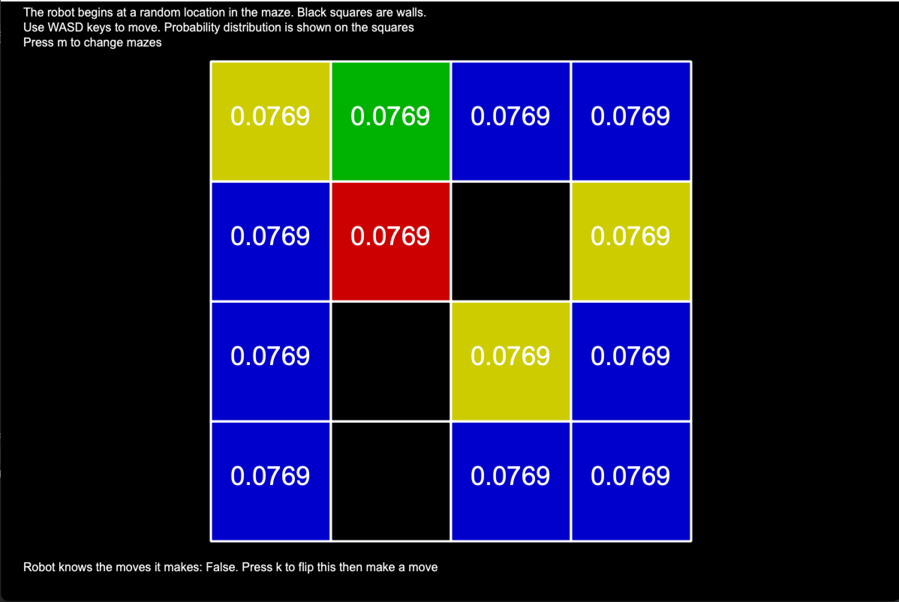
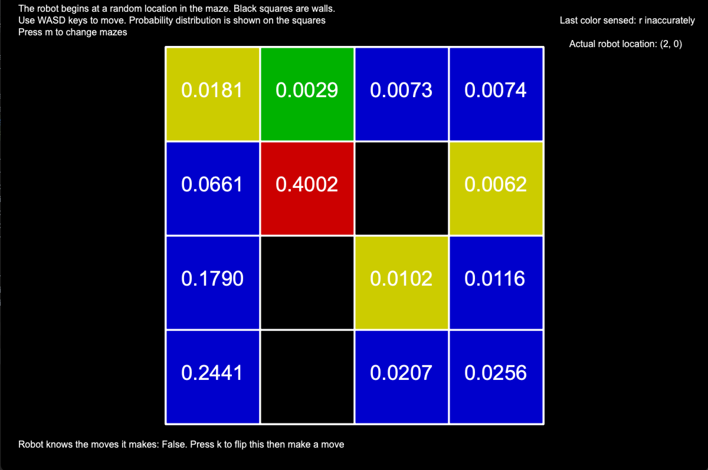
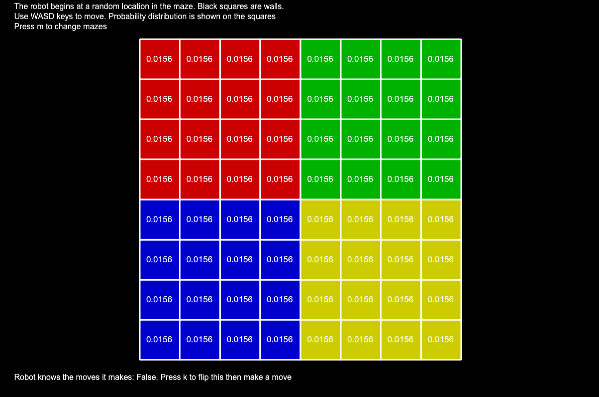
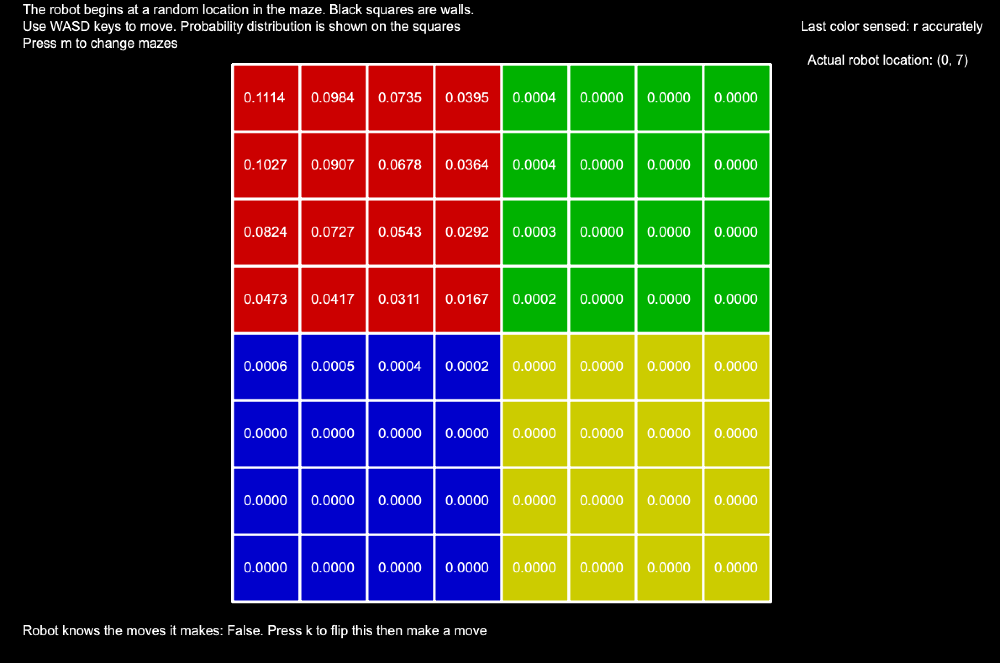
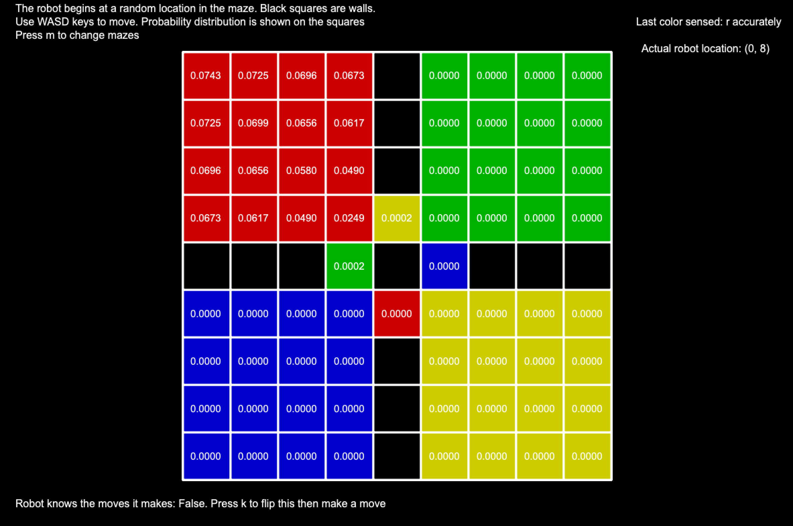
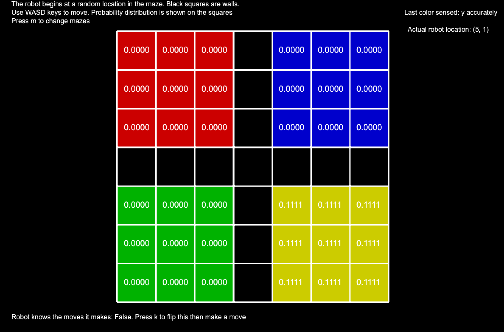
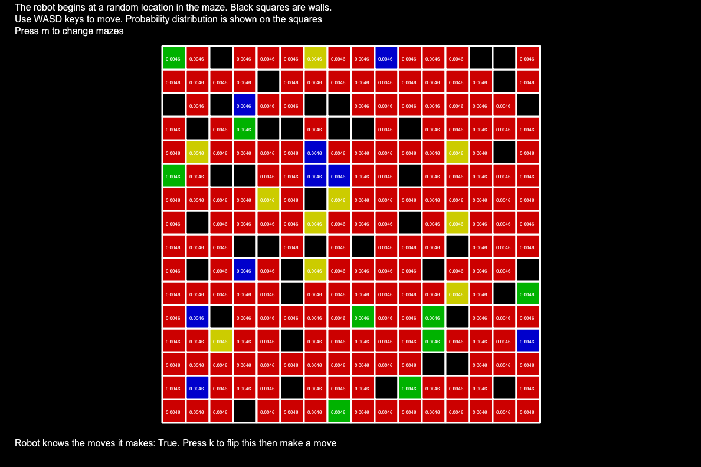

# Probabilistic Reasoning Over Time:
### Markov Models and Blind Robots on a Colored Maze
### Ben Williams '25 - October 2023

-----------------------------------

## Problem Definition

A blind robot is in an `n * m` maze. The robot can move North, East, South, or West. If the robot hits a wall it simply stays in the same place, and importantly, it does not know that it hit a wall.

The maze has colored floors: red, blue, yellow, and green. The robot has a color sensor that can sense the color below it _most of the time_. The robot senses the correct color 88% of the time, and one of the other three colors 4% of the time each. 

If the robot does not even know which directions it moved, and we are given a sequence of colors sensed, can we find out where the robot is? We use filtering to create a probability distribution.

A follow-up question: if the robot knows the moves it attempted to make as well as the colors sensed, how does that affect the probability distribution? 

## Maze Representation

The implementation of the maze can be seen in `ColoredMaze.py`. We read mazes from text files, where floors are marked as `{r, g, b, y}` for each of the colors, and a `#` for walls. For example, here is a 4x4 maze with mostly blue floors:

```
ygbb
br#y
b#yb
b#bb
```

One can optionally add a robot location to the text file by adding a line in the format `\robot 0 0`, with the x, y coordinates of the robot, but we do not use that functionality here (rather we randomly place a robot on the maze).

### Helper Functions

There are several helper functions that are relevant to the filtering we will see next. The first is `blind_movements_indices`.

The `blind_movements_indices` function takes an index as parameter, and looks at the locations you could move to from that location in the maze in one move. It returns a list of the indices that the robot could end up in, and indices can show up more than once. If a space has no walls surrounding it, then there will be a `0.25` (or 25%) chance that the robot would end up in each of the neighboring locations, so all the neighboring indices will be in the returned list. In a spot where there are walls or corners, the robot might attempt to move and hit a wall - so it could also end up in the same spot and the original index will be in the returned list. In the following maze, if we called the function on index 0 (the red square), we would return a list `[0, 0, 0, 2]` since three of the moves result in the robot staying at location 0, and moving south results in the robot ending at location 2:
```
r#
bg
```

The next helper function is `get_color_vector`. It takes a color in `{'r', 'g', 'b', 'y'}` as parameter, and outputs a vector of how likely a color reading is at every location on the maze. It assumes the sensor has 88% accuracy. So, the color vector for `'r'` would have `0.88` in all the locations/indices with red floors, and `0.04` for all the other squares representing an inaccurate sensor reading.

Those are the two relevant functions for the main filtering algorithm and the base problem we are trying to solve. There are other ones like `attempt_robot_move`, `get_color_faulty`, `get_direction_matrix`, and `randomize_robot_location` that are used for the visualizations or for accounting for the robot knowing where it tries to move.

## Filtering

The implementation of the filtering algorithm can be found in `FilteringMazePredictor.py`. 

### Initialization

The predictor takes a `ColoredMaze` object as parameter. Then, it creates the initial probability distribution and the random movement matrix, which will be defined below. Finally, it creates color vectors for all four colors using the `get_color_vector` function mentioned above, and the direction matrices for all the directions in `{'N', 'E', 'S', 'W'}`.

A probability distribution is in the format of a vector, where each index of the vector represents a location in the maze, and the value at that index is the probability that the robot is in that location.

### Initial State

We assume that the robot does not know where it is in the maze to begin with, so we assign an equal probability to every floor location in the maze. So, for the following maze:
```
rr
gg
##
```

The initial state/distribution is `<0.25, 0.25, 0.25, 0.25, 0, 0>` since there is a 25% chance that the robot is in any of the floor spaces, and cannot be in the bottom two wall spaces.

### Random movement matrix

This is a matrix representing what locations the robot can move to and with what probability for every location in the maze. We begin with a matrix of size `(n * m, n * m)` full of zeros. Then, we just call `blind_movements_indices` on each index that represents a floor space in order to find the locations a robot could move from there and add `0.25` for each possibility (which recall, can occur more than once if we hit walls as with the 2x2 maze shown before). 

### Solving

Now, given a list of sensors (and optionally the moves made), we can calculate the final probability distribution. 

With or without the movement list, the solver does the following:

1) Set a `current_state` to the `initial_state` that has already been calculated
2) Loop through the sensor readings, and call `get_next_state` with the color and the `current_state` as parameters, and the move made as an optional parameter if we know it. Set `current_state` to the result from `get_next_state`
3) Return the `current_state` after we have taken into account all the sensor readings

Within `get_next_state`:

1) Perform the prediction step, using either the random movement matrix or the direction matrix if we know which direction we moved in. This just takes into account where the robot could have moved from each location in the maze.
2) Perform the sensor update step, which multiplies the vector from after the predicted step by the appropriate color vector that we calculated in the initialization. 
3) Finally, we scale the vector so that it is a probability distribution (its values all add up to one), and return the result

## Illustration and Results: Only sensor readings

There are two ways that we can illustrate the probability distribution with a set of sensor readings. The first is with ascii art, seen in `test_moveable_robot.py` and the second is with the `gui_illustration`. We will use screenshots from the `gui_illustration` for this.

First, we begin with a small example on a 4x4 maze. The maze has mostly blue spaces and a few walls. We can use this small example to illustrate a few interesting points. In these examples, the robot __does not__ know the moves it made - so the predictions are only coming from the colors it sensed.

Here is the initial state:



As you can see, each location has an equal probability of occurring at the beginning, about 1/13, since there are 13 floor spaces that the robot can be in. 

Then, after a few repeated readings of `b`, we have the following result:


Firstly, all the blue locations have higher probabilities than all the other colors, which makes sense. But then, notice that the bottom left square has the highest probability. This makes sense, since if there are several blue readings in a row, we are likely to be surrounded by blue squares. Finally, note that the robot is actually wrong about its location - it is at (2,0) not (0,0), but the robot cannot know that given only the sensor readings.

We can see how the probability distribution gets skewed after an incorrect sensor reading. We begin at the state from the previous picture, and make repeated moves south (hitting a wall and staying in the blue (2,0)) until an incorrect reading:



The robot sensed red incorrectly, and now the red square has the highest probability. However, note that the (0,0) blue square still has the second-highest probability. In the previous state, that was the most likely location, and that information still transfers over to the new state.

On more complicated mazes, we can see how the surroundings of a square influence its probabilities. In the above 4x4 maze, you could think of the (0,0) square as being the deepest one in the blue territory / the farthest away from another color. We can use the quadrants maze to illustrate this. Here is the initial state of the quadrants maze:



Then, after repeated red sensor readings (we just pin the robot in the upper-left corner), we have the following probability distribution:



We can see that the top-left corner is the most likely location, and less-deep red squares have smaller probabilities. Note that the other colors along the borders have values barely above zero, while they are essentially 0 deep within the other territories. 

Doing the same thing with repeated red sensor readings where the quadrants are more blocked off influences the probabilities for the red territory:



Note how the probabilities became more evenly distributed across the red territory. The squares farther away from the middle still have higher probabilities, but it is less extreme. 

Finally, we can see the effect of a maze with more than one connected component. In this example, after a few yellow readings, the robot knows exactly which territory it is in, but has no idea where within the yellow quadrant it is:



Finally, just to show that the probabilities work on larger mazes, here is a 16x16 maze's initial state with majority red squares: 


Each square starts with a probability of `0.0046`, and unsurprisingly, red sensor readings provide little information, while repeated readings of other colors influence the probability distribution more.  

`ColoredMaze.py` can accept mazes of any size, but the GUI looks too cluttered (and the ascii too) with larger mazes than this.

## Illustration and Results: Robot knows the moves (extra)

Now, the robot has its compass again and knows which direction it moves in. This is important - since it allows us to see how much this additional information impacts the probability distribution. We begin again with the 4x4 maze. We pin the robot into location (0, 0) and make moves east, south, and west which we know will run into walls:

. Robot knows the moves it made")

The robot is now increasingly certain of where it is, since other spots on the maze would have made the robot likely sense another color given the moves we made. 

Then, we can see how pinning the robot down in a corner influences the probabilities on the walled quadrants maze. We again pin the robot into the top left corner at (0, 8):

 in the red territory")

Interestingly, the robot becomes less-able to determine exactly where it is in the sea of reds. Recall that the robot still doesn't know whether it hits a wall - it just knows that it has made repeated North and West moves. It seems that knowing the directions the robot moved can be (but is not always) helpful.

One final instance where it is very helpful is in the larger mazes. In the 16x16 maze, we can pin the robot into the top left corner with the green square. After repeated green readings and keeping the robot in that location, we know with high probability where we are:

 in the green square in the 16x16 maze")

The green probability is `~0.95`. If we do not know the moves and do the same thing, the probability for the correct square is actually `0.0000`, while the one for the green square on the right with the surrounding walls goes to `~0.98` (picture omitted for space), which makes sense since if we were moving the robot randomly and got repeated green readings that is the most likely place we could have gotten stuck. In this case, knowing the moves was actually very important as it allowed the robot to know which corner it was in. 


